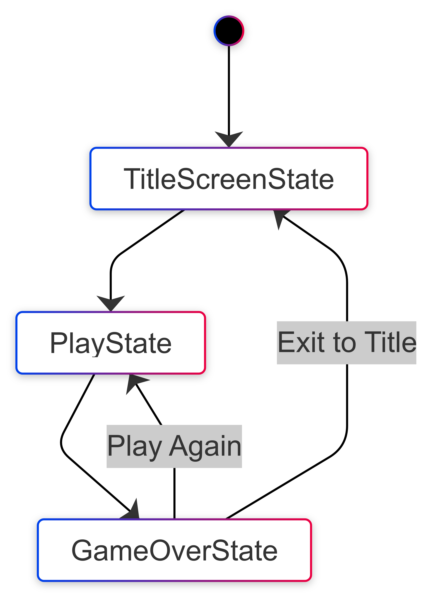
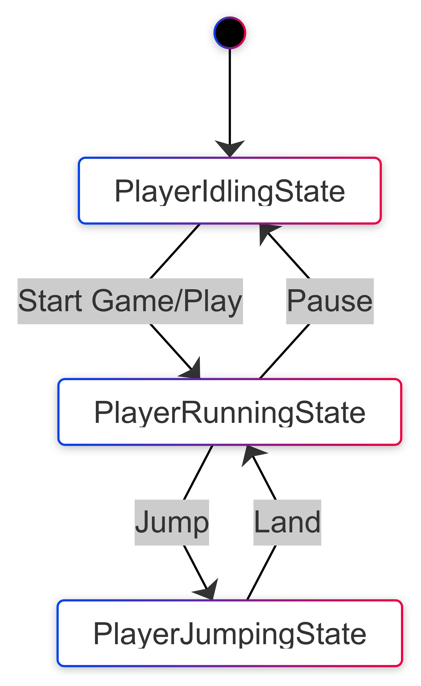
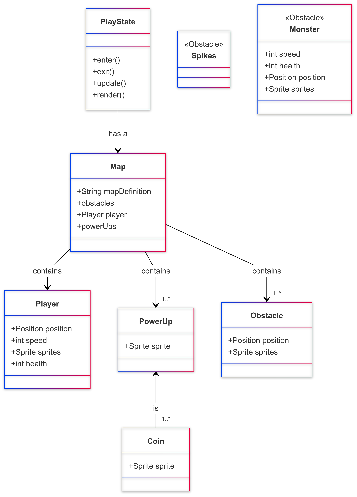

# Final Project

-   [ ] Read the [project requirements](https://vikramsinghmtl.github.io/420-5P6-Game-Programming/project/requirements).
-   [ ] Replace the sample proposal below with the one for your game idea.
-   [ ] Get the proposal greenlit by Vik.
-   [ ] Place any assets in `assets/` and remember to update `src/config.json`.
-   [ ] Decide on a height and width inside `src/globals.js`. The height and width will most likely be determined based on the size of the assets you find.
-   [ ] Start building the individual components of your game, constantly referring to the proposal you wrote to keep yourself on track.
-   [ ] Good luck, you got this!

---

# Sample Proposal - Endless Runner

## ✒️ Description

In this side-view endless runner game, players control a character running across a never-ending landscape filled with obstacles and power-ups. The goal is to keep the character alive for as long as possible by jumping or sliding to avoid obstacles like spikes, holes and enemies. Players can collect power-ups along the way, which may grant temporary invincibility, speed boosts, or double points. The game gets progressively faster and more challenging over time, testing the player's reflexes and timing. The game ends when the character collides with an obstacle, or falls in a hole and the player's score is based on how far they managed to run.

## 🕹️ Gameplay

Player start by hitting `ENTER` on their keyboard to start the game. The player then goes from idle to slowly running towards the right with the landscape updating as the character advances. Player should press `SPACE` to jump over obstacles and `s` to slide/duck underneath obstacles. The player can pick up coins to update his score and power-ups to gain special abilities. The player dies if he falls in a hole, hits an obstacle or hits a monster. There is no win condition as the game states, "endless runner", the game is aimed on getting a high score. Player either dies or goes on forever.

## 📃 Requirements

- The game should feature a continuous, randomly generated landscape with obstacles and power-ups.
- The player should control the character using keyboard inputs (SPACE for jumping, S for sliding).
- The system should randomly generate obstacles (spikes, holes, monsters) and power-ups (invincibility, speed boosts, double points).
- The game should progressively increase in speed and difficulty as the player advances.
- The system should track the player’s score based on the distance run.
- The game should end when the character collides with an obstacle/enemy.
- The system should display the player’s final score at the end of the game.

### 🤖 State Diagram

> [!note]
> Remember that you'll need diagrams for not only game states but entity states as well.

### 🗺️ Class Diagram

### 🧵 Wireframes

Start Screen: A simple title screen where players press ENTER to begin the endless running adventure.

Gameplay Screen: The main game view where the player controls the character to jump over and slide under obstacles, collect coins, and avoid hazards.

Game Over Screen: A clear "Game Over" screen displaying the player's score and providing options to replay or exit.

### 🎨 Assets

We used [app.diagrams.net](https://app.diagrams.net/) to create the wireframes. Wireframes are the equivalent to the skeleton of a web app since they are used to describe the functionality of the product and the users experience.

The GUI will be kept simple and playful, as to make sure the game is easy to understand what each component does.

#### 🖼️ Images

-   Most images will be used from (https://opengameart.org/) & [https://opengameart.org/](https://itch.io/game-assets)

#### 🔊 Sounds

All sounds will be taken from [freesound.org](https://freesound.org) 

### 📚 References

No references, but game will be inspired from games like Geometry Dash, Subway Surfers and Extreme Pamplona
